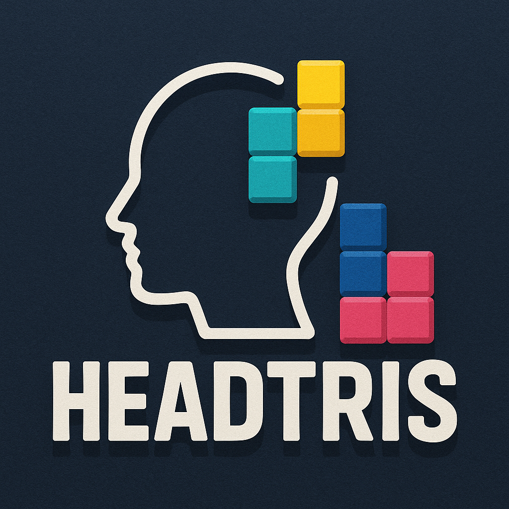

# HeadTris: A Head-Controlled Tetris Game

An innovative Tetris game controlled by your head movements via webcam, complete with modern visual effects and sounds.

---

## 🚀 Quick Start

| Play Online (PWA) | Android APK |
| :--- | :--- |
| [**🎮 Click to Play**](https://jasonydg.github.io/HeadTris/) | [**📥 Go to Releases to Download**](https://github.com/JasonYDG/HeadTris/releases) |
| *Supports all modern browsers, no download required* | *Download the latest APK for offline play* |

---

## 🎬 Game Demo

[Watch Demo Video](https://github.com/JasonYDG/HeadTris/raw/main/Demo.mp4)


---

## ✨ Features

- 👨‍💻 **Head Movement Control**: Real-time head pose recognition for a true hands-free experience.
- 🎨 **Modern Graphics**: Sleek UI design and fluid animations.
- 🔊 **Sound System**: Classic BGM and sound effects generated in real-time with the Web Audio API.
- 🏆 **Smart Scoring System**: Earn more points for clearing multiple lines and at higher levels.
- 🧱 **Optimized Block Distribution**: Intelligently generates long blocks to ensure a balanced and enjoyable game.
- 📱 **Responsive Design**: Perfect for both desktop and mobile devices.
- ⌨️ **Multiple Control Schemes**: Supports head, keyboard, and touch controls for any situation.

---

## 🕹️ How to Play

### Head Control (Primary)
| Action | Effect | Notes |
| :--- | :--- | :--- |
| **Tilt Head Left/Right** | Move block left/right | A slight tilt is enough; supports continuous movement. |
| **Open Mouth** | Rotate block | A quick, clear motion is recognized accurately. |
| **Lift Head Up** | Continuous fast drop | Lift head to reduce eye-mouth distance for continuous fast descent. |

### Keyboard Control (Alternative)
- **←** / **→** : Move Left / Right
- **↓** : Accelerate Descent
- **↑** / **Space** : Rotate
- **P** : Pause / Resume

### Touch Control (Mobile)
- **Swipe Left/Right**: Move Left / Right
- **Swipe Down**: Accelerate Descent
- **Tap Screen**: Rotate

---

## 🛠️ Tech Stack

- **Core**: Vanilla HTML5 + CSS3 + JavaScript (no dependencies)
- **Face Recognition**: Google MediaPipe Face Mesh
- **Game Engine**: Canvas 2D API
- **Sound System**: Web Audio API
- **Camera Access**: WebRTC `getUserMedia` API

---

## 📂 File Structure

```
.
├── index.html              # Main page
├── style.css               # Stylesheet
├── tetris.js               # Core game logic
├── head-control-simple.js  # Head movement detection and control
├── game-fixed.js           # Main game controller
├── sw.js                   # Service Worker for PWA
├── manifest.json           # PWA configuration file
├── Demo.mp4                # Game demo video
├── Logo.png                # Project Logo
├── sounds/                 # Sound assets directory
│   └── README.md
└── README.md               # This file
```

---

## 📝 Development Notes

To adjust control sensitivity, you can modify the following parameters in `head-control-simple.js`:

```javascript
this.headTiltThreshold = 0.15;  // Head tilt sensitivity
this.headLiftThreshold = 0.05;  // Head lift sensitivity
this.mouthOpenThreshold = 0.02; // Mouth open sensitivity
this.actionCooldown = 300;      // Cooldown between actions (in ms)
```

---

## 📄 License

This project is licensed under the [MIT](https://opensource.org/licenses/MIT) License.
